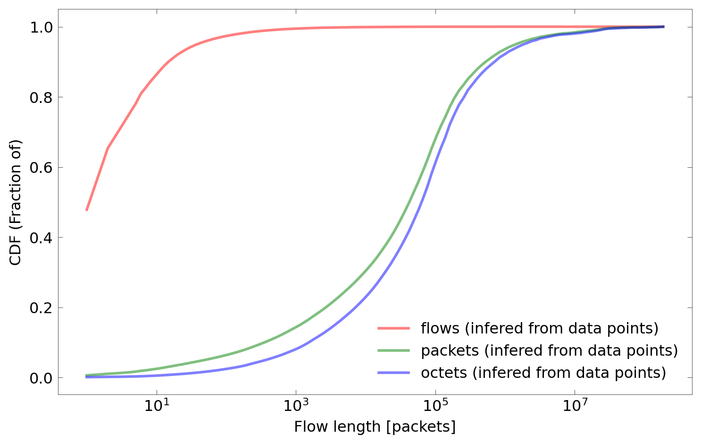
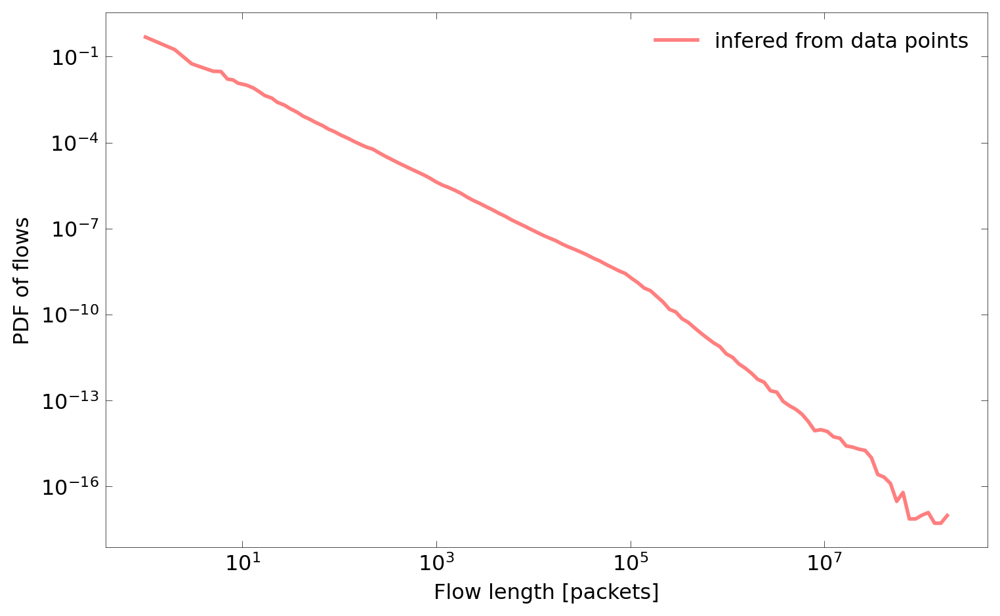
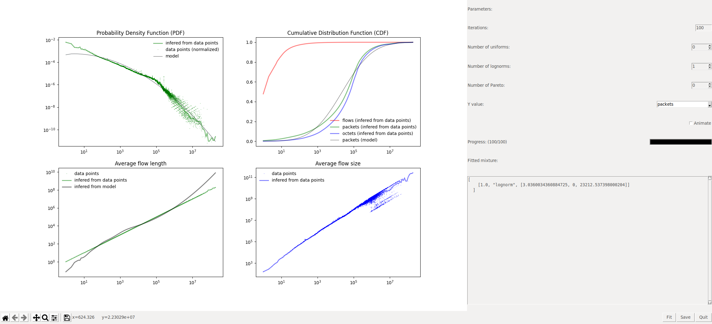
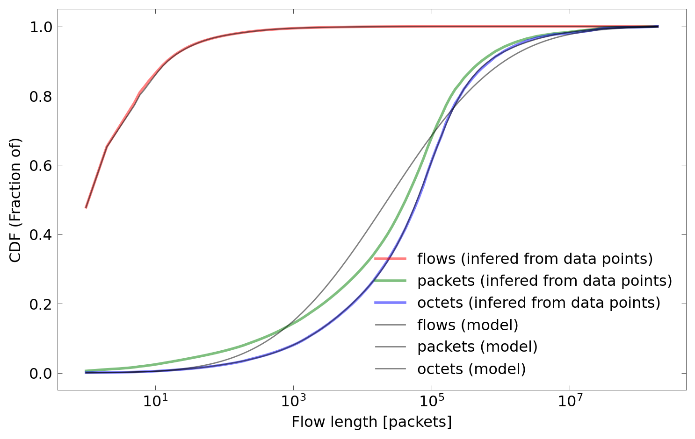
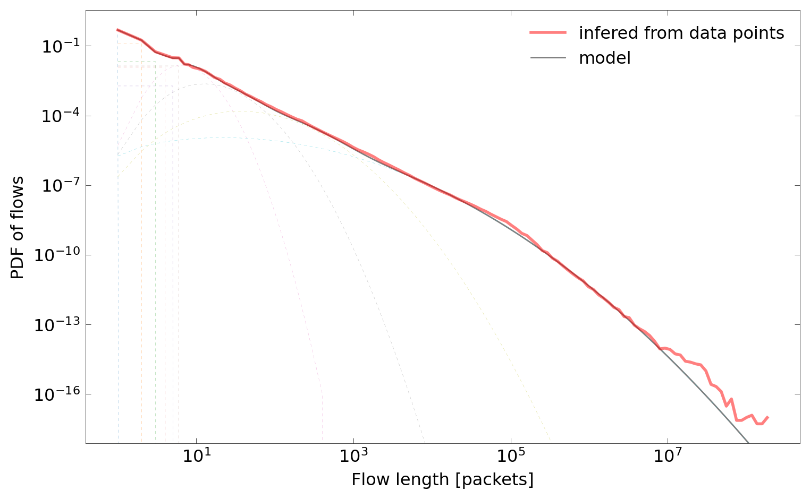
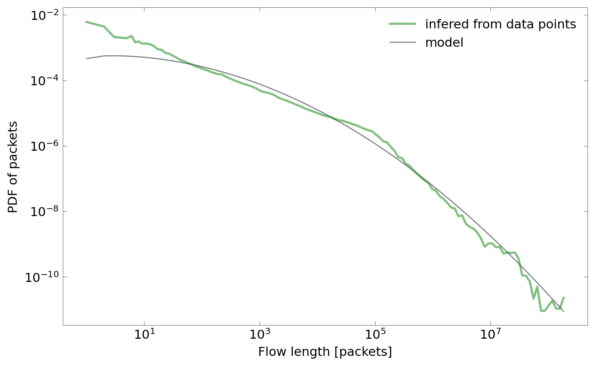
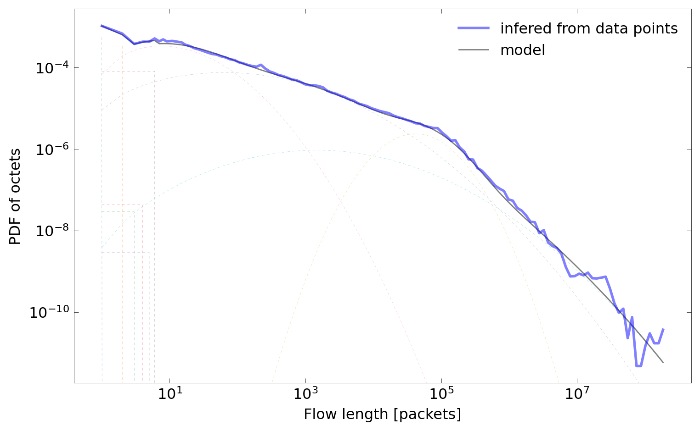

Distribution fitting tutorial
*****************************

.. toctree::
   :maxdepth: 2

Here we present a tutorial, which provides a step by step guide through the distribution fitting and model creation process. In order to be able to follow the tutorial with the data publicly available in the project's repository, it starts after flow binning (that is with a flow histogram CSV file). To get a reference how to create histogram file from flow records, `workflow` and `Makefile <https://github.com/piotrjurkiewicz/flow-models/blob/master/data/agh_2015/Makefile>`_ should be consulted.

First, it must be ensured that the required Python's standard library modules are installed. This applies in particular to `tkinter` and `venv` modules, which in some distributions are not installed by default with the Python's binaries. On Debian-like system, they can be installed using the following command:

.. code-block:: shell-session

    $ sudo apt-get install python3-venv python3-tk
    Reading package lists... Done
    Building dependency tree
    Reading state information... Done
    python3-venv is already the newest version (3.8.2-0ubuntu2).
    python3-tk is already the newest version (3.8.5-1~20.04.1).
    0 upgraded, 0 newly installed, 0 to remove and 0 not upgraded.

We will conduct our experiments in a virtual environment. Alternatively, the ``flow-models`` package can be installed systemwide with the ``pip`` command, in which case the `numpy`, `scipy`, `pandas` and `matplotlib` should be present on the system.

The listing below shows the process of virtual environment preparation. The user should first initialize a virtual environment. Then, the ``pip`` command is used to install the ``flow-models`` package from `Python Package Index <https://pypi.org/project/flow-models/>`_ along with its dependencies.

.. code-block:: shell-session

    $ python3 -m venv test
    $ cd test
    $ bin/pip install flow-models numpy scipy pandas matplotlib
    Collecting flow-models
      Downloading flow_models-1.1-py3-none-any.whl (34 kB)
    Collecting numpy
      Downloading numpy-1.19.5-cp38-cp38-manylinux2010_x86_64.whl (14.9 MB)
         |████████████████████████████████| 14.9 MB 5.9 MB/s
    Collecting scipy
      Downloading scipy-1.6.0-cp38-cp38-manylinux1_x86_64.whl (27.2 MB)
         |████████████████████████████████| 27.2 MB 6.8 MB/s
    Collecting pandas
      Downloading pandas-1.2.0-cp38-cp38-manylinux1_x86_64.whl (9.7 MB)
         |████████████████████████████████| 9.7 MB 6.6 MB/s
    Collecting matplotlib
      Downloading matplotlib-3.3.3-cp38-cp38-manylinux1_x86_64.whl (11.6 MB)
         |████████████████████████████████| 11.6 MB 998 kB/s
    Collecting pytz>=2017.3
      Downloading pytz-2020.5-py2.py3-none-any.whl (510 kB)
         |████████████████████████████████| 510 kB 4.2 MB/s
    Collecting python-dateutil>=2.7.3
      Downloading python_dateutil-2.8.1-py2.py3-none-any.whl (227 kB)
         |████████████████████████████████| 227 kB 7.1 MB/s
    Collecting cycler>=0.10
      Downloading cycler-0.10.0-py2.py3-none-any.whl (6.5 kB)
    Collecting pyparsing!=2.0.4,!=2.1.2,!=2.1.6,>=2.0.3
      Downloading pyparsing-2.4.7-py2.py3-none-any.whl (67 kB)
         |████████████████████████████████| 67 kB 7.6 MB/s
    Collecting pillow>=6.2.0
      Downloading Pillow-8.1.0-cp38-cp38-manylinux1_x86_64.whl (2.2 MB)
         |████████████████████████████████| 2.2 MB 6.3 MB/s
    Collecting kiwisolver>=1.0.1
      Downloading kiwisolver-1.3.1-cp38-cp38-manylinux1_x86_64.whl (1.2 MB)
         |████████████████████████████████| 1.2 MB 5.9 MB/s
    Collecting six>=1.5
      Downloading six-1.15.0-py2.py3-none-any.whl (10 kB)
    Installing collected packages: flow-models, numpy, scipy, pytz, six, python-dateutil, pandas, cycler, pyparsing, pillow, kiwisolver, matplotlib
    Successfully installed cycler-0.10.0 flow-models-1.1 kiwisolver-1.3.1 matplotlib-3.3.3 numpy-1.19.5 pandas-1.2.0 pillow-8.1.0 pyparsing-2.4.7 python-dateutil-2.8.1 pytz-2020.5 scipy-1.6.0 six-1.15.0

In this tutorial, we will use the dataset ``agh_2015``, which is provided in the project's Git repository. The provided dataset does not contain flow records due to privacy and size concerns. Therefore, we will start the fitting process with the histogram file, which was previously created from flow records with the `tools/hist` command.

Using the commands below, the archive of project's Git repository can be downloaded from GitHub. Next, a directory containing ``agh_2015`` dataset is extracted from the archive.

.. code-block:: shell-session

    $ wget https://github.com/piotrjurkiewicz/flow-models/archive/master.tar.gz
    --2021-01-16 00:26:08--  https://github.com/piotrjurkiewicz/flow-models/archive/master.tar.gz
    Resolving github.com (github.com)... 140.82.121.3
    Connecting to github.com (github.com)|140.82.121.3|:443... connected.
    HTTP request sent, awaiting response... 302 Found
    Location: https://codeload.github.com/piotrjurkiewicz/flow-models/tar.gz/master [following]
    --2021-01-16 00:26:09--  https://codeload.github.com/piotrjurkiewicz/flow-models/tar.gz/master
    Resolving codeload.github.com (codeload.github.com)... 140.82.121.10
    Connecting to codeload.github.com (codeload.github.com)|140.82.121.10|:443... connected.
    HTTP request sent, awaiting response... 200 OK
    Length: unspecified [application/x-gzip]
    Saving to: ‘master.tar.gz’

    master.tar.gz                          [           <=>                                                   ]   5,19M  2,32MB/s    in 2,2s

    2021-01-16 00:26:11 (2,32 MB/s) - ‘master.tar.gz’ saved [5442386]

    $ tar -zxf master.tar.gz --strip-components=2 flow-models-master/data/agh_2015/
    $ cd agh_2015
    $ ls -la
    total 48
    drwxrwxr-x 6 jurkiew jurkiew 4096 sty 16 00:20 .
    drwxrwxr-x 7 jurkiew jurkiew 4096 sty 16 00:26 ..
    drwxrwxr-x 6 jurkiew jurkiew 4096 sty 16 00:20 elephants
    -rw-rw-r-- 1 jurkiew jurkiew   45 sty 16 00:20 .gitignore
    drwxrwxr-x 5 jurkiew jurkiew 4096 sty 16 00:20 histograms
    -rw-rw-r-- 1 jurkiew jurkiew 4337 sty 16 00:20 Makefile
    drwxrwxr-x 5 jurkiew jurkiew 4096 sty 16 00:20 mixtures
    drwxrwxr-x 5 jurkiew jurkiew 4096 sty 16 00:20 plots
    -rw-rw-r-- 1 jurkiew jurkiew 8947 sty 16 00:20 README.md

Firstly, we will use the `tools/summary` tool to get a grasp on the data. The tools generates TeX tables containing overall traffic characteristics and distributions of selected features.

.. code-block:: shell-session

    $ python3 -m flow_models.summary --help
    usage: summary.py [-h] [-x {length,size,duration,rate}] file

    Produces TeX tables containing summary statistics of flow dataset (requires `scipy`).

    positional arguments:
      file                  csv_hist file to summarize

    optional arguments:
      -h, --help            show this help message and exit
      -x {length,size,duration,rate}
                            x axis value

Specifically, with the command below, a distribution table for flow length of all transport layer protocol flows will be created.

.. code-block:: shell-session

    $ python3 -m flow_models.summary -x length histograms/all/length.csv
    0.00 Loading file histograms/all/length.csv
    0.02 Loaded file histograms/all/length.csv
    \begin{tabular}{@{}lrr@{}}
    \toprule
    \textbf{Dataset name} & XXX & \\
    \textbf{Exporter} & XXX & \\
    \textbf{L2 technology} & XXX & \\
    \textbf{Sampling rate} & none & \\
    \textbf{Active timeout} & XXX & seconds \\
    \textbf{Inactive timeout} & XXX & seconds \\
    \midrule
    \textbf{Number of flows} & 4 032 376 751 & flows \\
    \textbf{Number of packets} & 316 857 594 090 & packets \\
    \textbf{Number of octets} & 275 858 498 994 998 & octets \\
    \textbf{Average flow length} & 78.578370 & packets \\
    \textbf{Average packet size} & 870.607188 & bytes \\
    \bottomrule
    \end{tabular}

    \begin{tabular}{@{}lrrr@{}}
    \toprule
    \textbf{Flows of length up to} & \multicolumn{3}{c}{\textbf{Make up \%}} \\
    \cmidrule(lr){2-4}
    \multicolumn{1}{c}{(packets)} & of flows & of packets & of octets \\
    \midrule
    1 & 47.8326 & 0.6087 & 0.1047 \\
    2 & 65.3421 & 1.0544 & 0.1728 \\
    4 & 74.8933 & 1.4696 & 0.2537 \\
    8 & 84.1319 & 2.1958 & 0.4412 \\
    16 & 90.5756 & 3.1633 & 0.7830 \\
    32 & 94.3448 & 4.2601 & 1.2432 \\
    64 & 96.4556 & 5.4778 & 1.8863 \\
    128 & 97.7421 & 6.9597 & 2.7813 \\
    256 & 98.5940 & 8.9276 & 4.1445 \\
    512 & 99.1268 & 11.3677 & 5.8630 \\
    1024 & 99.4631 & 14.4387 & 8.1638 \\
    2048 & 99.6735 & 18.2982 & 11.5607 \\
    4096 & 99.7996 & 22.9151 & 15.7909 \\
    8192 & 99.8763 & 28.5232 & 21.1317 \\
    16384 & 99.9249 & 35.6866 & 28.1781 \\
    32768 & 99.9581 & 45.4771 & 37.5978 \\
    65536 & 99.9805 & 58.5799 & 50.6331 \\
    131072 & 99.9933 & 73.2677 & 67.2524 \\
    262144 & 99.9981 & 83.9341 & 80.4658 \\
    524288 & 99.9994 & 89.9643 & 87.8132 \\
    1048576 & 99.9998 & 93.8108 & 92.4499 \\
    2097152 & 99.9999 & 96.1228 & 95.3632 \\
    4194304 & 100.0000 & 97.4923 & 97.1079 \\
    8388608 & 100.0000 & 98.2361 & 97.9085 \\
    16777216 & 100.0000 & 98.9066 & 98.5953 \\
    \bottomrule
    \end{tabular}

Similarly, a distribution table for flows depending on their size can also be generated:

.. code-block:: shell-session

    $ python3 -m flow_models.summary -x size histograms/all/size.csv
    0.00 Loading file histograms/all/size.csv
    0.03 Loaded file histograms/all/size.csv
    \begin{tabular}{@{}lrr@{}}
    \toprule
    \textbf{Dataset name} & XXX & \\
    \textbf{Exporter} & XXX & \\
    \textbf{L2 technology} & XXX & \\
    \textbf{Sampling rate} & none & \\
    \textbf{Active timeout} & XXX & seconds \\
    \textbf{Inactive timeout} & XXX & seconds \\
    \midrule
    \textbf{Number of flows} & 4 032 376 751 & flows \\
    \textbf{Number of packets} & 316 857 594 090 & packets \\
    \textbf{Number of octets} & 275 858 498 994 998 & octets \\
    \textbf{Average flow length} & 78.578370 & packets \\
    \textbf{Average packet size} & 870.607188 & bytes \\
    \bottomrule
    \end{tabular}

    \begin{tabular}{@{}lrrr@{}}
    \toprule
    \textbf{Flows of size up to} & \multicolumn{3}{c}{\textbf{Make up \%}} \\
    \cmidrule(lr){2-4}
    \multicolumn{1}{c}{(bytes)} & of flows & of packets & of octets \\
    \midrule
    64 & 4.3082 & 0.0548 & 0.0040 \\
    128 & 32.3376 & 0.4196 & 0.0424 \\
    256 & 56.8711 & 0.9477 & 0.1030 \\
    512 & 71.1101 & 1.4143 & 0.1780 \\
    1024 & 79.0397 & 1.9054 & 0.2622 \\
    2048 & 85.1875 & 2.5299 & 0.3934 \\
    4096 & 89.7296 & 3.3290 & 0.5845 \\
    8192 & 93.3566 & 4.3322 & 0.8893 \\
    16384 & 95.5716 & 5.4704 & 1.2615 \\
    32768 & 96.9528 & 6.8395 & 1.7291 \\
    65536 & 97.9404 & 8.6738 & 2.4039 \\
    131072 & 98.6475 & 11.0574 & 3.3593 \\
    262144 & 99.1010 & 13.7902 & 4.5884 \\
    524288 & 99.4223 & 17.2061 & 6.3013 \\
    1048576 & 99.6170 & 21.4081 & 8.4021 \\
    2097152 & 99.7535 & 26.8052 & 11.3751 \\
    4194304 & 99.8482 & 34.0454 & 15.4285 \\
    8388608 & 99.9062 & 41.9799 & 20.4089 \\
    16777216 & 99.9417 & 49.1464 & 26.5380 \\
    33554432 & 99.9659 & 56.7035 & 34.8691 \\
    67108864 & 99.9811 & 64.7587 & 45.4158 \\
    134217728 & 99.9918 & 74.5181 & 60.2736 \\
    268435456 & 99.9974 & 84.0504 & 75.4365 \\
    536870912 & 99.9992 & 90.1155 & 84.9595 \\
    1073741824 & 99.9998 & 93.8573 & 90.6786 \\
    \bottomrule
    \end{tabular}

Now having the grasp on basic data properties, let's get an insight into the details. This can be done by plotting empirical probability distribution functions and cumulative distribution functions of flow features. The `tools/plot` tools can be used for that purpose.

.. code-block:: shell-session

    $ python3 -m flow_models.plot --help
    usage: plot.py [-h] [--format {png,pdf}] [--single] [--no-normalize] [--fft] [-P {points,hist,kde,comp,comp_stack,comp_labels}] [-C {comp,comp_stack,comp_labels}]
                   [-x {length,size,duration,rate}]
                   histogram [mixture]

    Generates plots from flow records and fitted models (requires `pandas` and `scipy`).

    positional arguments:
      histogram             csv_hist file to plot
      mixture               mixture directory to plot

    optional arguments:
      -h, --help            show this help message and exit
      --format {png,pdf}    plot file format
      --single              plot PDF and CDF in single file
      --no-normalize        do not normalize PDF datapoints
      --fft                 use FFT for calculating KDE
      -P {points,hist,kde,comp,comp_stack,comp_labels}
                            additional PDF plot modes (can be specified multiple times)
      -C {comp,comp_stack,comp_labels}
                            additional CDF plot modes (can be specified multiple times)
      -x {length,size,duration,rate}
                            x axis value

The command below will generate plots of PDF and CDF of number of flows, packets and octets (bytes) in function of flow length. Additionally, plots presenting an average number of packets, octets and packet size depending on flow's length will be created.

.. code-block:: shell-session

    $ python3 -m flow_models.plot histograms/all/length.csv
    0.00 Loading file histograms/all/length.csv
    0.02 Loaded file histograms/all/length.csv
    0.04 Drawing CDF histograms/all/length.csv flows
    0.05 Drawing CDF histograms/all/length.csv packets
    0.05 Drawing CDF histograms/all/length.csv octets
    0.06 Saving cdf
    0.67 Done cdf
    0.69 Drawing PDF histograms/all/length.csv flows
    0.69 Normalizing data
    0.70 Using bin_calc_log with exponent 12
    0.71 Normalizing data
    0.72 Saving pdf-flows
    1.24 Done pdf-flows
    1.26 Drawing PDF histograms/all/length.csv packets
    1.26 Normalizing data
    1.26 Using bin_calc_log with exponent 12
    1.28 Normalizing data
    1.28 Saving pdf-packets
    1.72 Done pdf-packets
    1.74 Drawing PDF histograms/all/length.csv octets
    1.74 Normalizing data
    1.74 Using bin_calc_log with exponent 12
    1.76 Normalizing data
    1.76 Saving pdf-octets
    2.17 Done pdf-octets
    2.19 Drawing AVG histograms/all/length.csv packets
    2.20 Saving avg-packets
    2.57 Done avg-packets
    2.58 Drawing AVG histograms/all/length.csv octets
    2.59 Saving avg-octets
    3.07 Done avg-octets
    3.09 Drawing AVG histograms/all/length.csv packet_size
    3.11 Saving avg-packet_size
    3.54 Done avg-packet_size

    $ ls -la
    total 596
    drwxrwxr-x 6 jurkiew jurkiew   4096 sty 16 00:34 .
    drwxrwxr-x 7 jurkiew jurkiew   4096 sty 16 00:29 ..
    -rw-rw-r-- 1 jurkiew jurkiew  68690 sty 16 00:34 avg-octets.png
    -rw-rw-r-- 1 jurkiew jurkiew 133890 sty 16 00:34 avg-packet_size.png
    -rw-rw-r-- 1 jurkiew jurkiew  63385 sty 16 00:34 avg-packets.png
    -rw-rw-r-- 1 jurkiew jurkiew  96648 sty 16 00:34 cdf.png
    drwxrwxr-x 6 jurkiew jurkiew   4096 sty 16 00:20 elephants
    -rw-rw-r-- 1 jurkiew jurkiew     45 sty 16 00:20 .gitignore
    drwxrwxr-x 5 jurkiew jurkiew   4096 sty 16 00:20 histograms
    -rw-rw-r-- 1 jurkiew jurkiew   4337 sty 16 00:20 Makefile
    drwxrwxr-x 5 jurkiew jurkiew   4096 sty 16 00:20 mixtures
    -rw-rw-r-- 1 jurkiew jurkiew  60540 sty 16 00:34 pdf-flows.png
    -rw-rw-r-- 1 jurkiew jurkiew  57914 sty 16 00:34 pdf-octets.png
    -rw-rw-r-- 1 jurkiew jurkiew  66312 sty 16 00:34 pdf-packets.png
    drwxrwxr-x 5 jurkiew jurkiew   4096 sty 16 00:20 plots
    -rw-rw-r-- 1 jurkiew jurkiew   8947 sty 16 00:20 README.md

As can be seen on the directory listing above, plots were created in the current working directory as PNG files. The figure below presents the CDF plot (``cdf.png``).

Additionally, we show the PDF plot of flows (``pdf-flows.png``):

Now let's move to the fitting process, which is the core operation of hte framework. It can be performed with the `tools/fit` tool. Similarly as with previous commands, flow histogram CSV should be given as an input.

.. code-block:: shell-session

    $ python3 -m flow_models.fit --help
    usage: fit.py [-h] [-y {flows,packets,octets}] [-i I] [-U U] [-P P] [-L L] [--mpw MPW] [--initial INITIAL] [--interactive] [--test] [--measure-memory] file

    Creates General Mixture Models (GMM) fitted to flow records (requires `scipy`).

    positional arguments:
      file                  input histogram file

    optional arguments:
      -h, --help            show this help message and exit
      -y {flows,packets,octets}
                            y axis value (default: flows)
      -i I                  number of iterations (default: 100)
      -U U                  number of uniform distributions (default: None)
      -P P                  number of Pareto distributions (default: None)
      -L L                  number of lognorm distributions (default: None)
      --mpw MPW             maximum pareto weight (default: None)
      --initial INITIAL     initial mixture (default: {})
      --interactive         interactive (default: False)
      --test                test fitting (default: False)
      --measure-memory      collect and print memory statistics (default: False)

The `tools/fit` tools can operate in the batch and the interactive mode. Below we will perform mixture fitting for the flows distribution in function flow's length in the batch mode. In such a case, number of iterations (``i``) and number of each type of distributions (``U`` and ``L``) should be specified as command line parameters.

.. code-block:: shell-session

    $ python3 -m flow_models.fit -i 400 -U 6 -L 4 -y flows histograms/all/length.csv
    0.00 Processing: histograms/all/length.csv
    0.05 Iteration: 0
    ...
    12.29 Iteration: 399
    12.29 Saving: flows

    $ cat flows.json
    {
      "sum": 4032376751,
      "mix": [
        [0.3050265769901237, "uniform", [0, 1]],
        [0.24841988004416196, "uniform", [0, 2]],
        [0.06366063664158104, "uniform", [0, 3]],
        [0.04921649965932878, "uniform", [0, 4]],
        [0.00931559166293734, "uniform", [0, 5]],
        [0.08217474157187263, "uniform", [0, 6]],
        [0.1312637498251484, "lognorm", [0.5207023493412831, 0, 7.805599279070412]],
        [0.07328615421743442, "lognorm", [0.7701056575379248, 0, 22.10972501544735]],
        [0.029289126487159662, "lognorm", [1.1252645297342552, 0, 128.6451515069823]],
        [0.008347042900250784, "lognorm", [1.9838369452408506, 0, 1084.4707584768773]]
      ]
    }

The fitted mixture is saved into a JSON file in the current working directory. In this case, this is the file ``flows.json``, which contents is listed above.

Alternatively, a user can perform interactive fitting with the GUI. In such a case, the tool should be started with the ``--interactive`` parameter.

.. code-block:: shell-session

    $ python3 -m flow_models.fit -i 100 -L 1 -y packets --interactive histograms/all/length.csv

The figure below shows a screenshot of the interactive fitting tool. User can change parameters (number of iterations and number of distributions) on the right panel. After clicking the fit button, the process starts. Its progress can be monitored on the progress bar. Additionally, after checking the animate checkbox, current distribution mixture will be plotted after each iteration. This allows to observe the fitting process in real time. The window on the bottom-right shows the current distribution mixture in JSON format.

After achieving a satisfying result, the mixture can be saved to a JSON file using the save button.

.. figure:: _static/fit-save.png
   :alt: Saving a mixture to file after interactive fitting.

In this example, we fitted an oversimplified distribution of packets in function of flow's length, which consists only of one lognormal distribution.

.. code-block:: shell-session

    $ $ cat packets.json
    {
      "sum": 316857594090,
      "mix": [
        [1.0, "lognorm", [3.0360034360884725, 0, 23212.537398000204]]
      ]
    }

To get a complete model, we also fit octets distribution, this time in the batch mode.

.. code-block:: shell-session

    $ python3 -m flow_models.fit -i 400 -U 6 -L 4 -y octets histograms/all/length.csv
    0.00 Processing: histograms/all/length.csv
    0.04 Iteration: 0
    ...
    12.77 Iteration: 399
    12.77 Saving: octets

    $ cat octets.json
    {
      "sum": 275858498994998,
      "mix": [
        [0.0005522188937705091, "uniform", [0, 1]],
        [0.0006733419371011695, "uniform", [0, 2]],
        [8.71245062931499e-08, "uniform", [0, 3]],
        [1.7242898989450512e-07, "uniform", [0, 4]],
        [1.4615786843822244e-08, "uniform", [0, 5]],
        [0.0004861299541601525, "uniform", [0, 6]],
        [0.025410773535068345, "lognorm", [1.473422030663434, 0, 60.4690999927677]],
        [0.4788838926136253, "lognorm", [2.3777777137900604, 0, 17998.56065028383]],
        [0.3478874901495339, "lognorm", [0.9182616898670918, 0, 97153.89719008346]],
        [0.14610587874745912, "lognorm", [2.3961482058920276, 0, 458689.5696009713]]
      ]
    }

Now the model, which consists of three JSON mixture files (``flows.json``, ``packets.json`` and ``octets.json``) is complete. It can be moved to a separate directory ``my_mixture``. We will use that directory to plot the mixture model along with data.

.. code-block:: shell-session

    $ mkdir my_mixture
    $ mv flows.json packets.json octets.json my_mixture/

The `tools/plot` tool can be used not only to plot empirical distribution functions from histogram files, but also mixture models. Both can be plotted on the same figure in order to enable their comparison. For this, a path to a directory containing model JSON files should be provided after the path to a histogram CSV file.

.. code-block:: shell-session

    $ python3 -m flow_models.plot histograms/all/length.csv my_mixture/
    0.00 Loading file histograms/all/length.csv
    0.02 Loaded file histograms/all/length.csv
    0.02 Loading file my_mixture
    0.02 Loaded file my_mixture
    0.04 Drawing CDF histograms/all/length.csv flows
    0.05 Drawing CDF histograms/all/length.csv packets
    0.05 Drawing CDF histograms/all/length.csv octets
    0.06 Drawing CDF my_mixture flows
    0.06 Drawing CDF my_mixture packets
    0.07 Drawing CDF my_mixture octets
    0.08 Saving cdf
    0.71 Done cdf
    0.73 Drawing PDF histograms/all/length.csv flows
    0.74 Normalizing data
    0.74 Using bin_calc_log with exponent 12
    0.75 Normalizing data
    0.76 Drawing PDF my_mixture flows
    0.77 Saving pdf-flows
    1.29 Done pdf-flows
    1.31 Drawing PDF histograms/all/length.csv packets
    1.31 Normalizing data
    1.31 Using bin_calc_log with exponent 12
    1.33 Normalizing data
    1.33 Drawing PDF my_mixture packets
    1.33 Saving pdf-packets
    1.79 Done pdf-packets
    1.81 Drawing PDF histograms/all/length.csv octets
    1.81 Normalizing data
    1.81 Using bin_calc_log with exponent 12
    1.83 Normalizing data
    1.83 Drawing PDF my_mixture octets
    1.84 Saving pdf-octets
    2.26 Done pdf-octets
    2.28 Drawing AVG histograms/all/length.csv packets
    2.29 Drawing AVG my_mixture packets
    2.30 Saving avg-packets
    2.90 Done avg-packets
    2.92 Drawing AVG histograms/all/length.csv octets
    2.93 Drawing AVG my_mixture octets
    2.95 Saving avg-octets
    3.45 Done avg-octets
    3.47 Drawing AVG histograms/all/length.csv packet_size
    3.49 Drawing AVG my_mixture packet_size
    3.51 Saving avg-packet_size
    4.15 Done avg-packet_size

As can be seen on the plots below, empirical functions are presented along with models, including the oversimplified model of packets distribution created in the interactive mode.

Additionally, mixture components can be plotted along with the resulting model (dashed lines):

Finally, the constructed model can be used to generate flows. The tool `tools/generate` can be used for that purpose. It is not particularly useful on its own. Instead, its goal is to provide a reference and serve as an example of how to properly generate traffic from flow models.

In the case presented below, the model from ``my_mixture`` directory is used to generate 20 flow records in `csv_flow` format using two different seeds.

.. code-block:: shell-session

    $ python3 -m flow_models.generate --help
    usage: generate.py [-h] [-s S] [--seed SEED] [-x {length,size,duration,rate}] [-o {csv_flow,binary,none}] [-O O] file

    Generates flow records from histograms or mixture models.

    positional arguments:
      file                  csv_hist file or mixture directory

    optional arguments:
      -h, --help            show this help message and exit
      -s S                  number of generated flows
      --seed SEED           seed
      -x {length,size,duration,rate}
                            x axis value
      -o {csv_flow,binary,none}
                            format of output
      -O O                  file or directory for output

    $ python3 -m flow_models.generate -x length -s 20 --seed 0 my_mixture/
    0.00 Loading file my_mixture
    0.00 Loaded file my_mixture
    0, 0, 0, 0, 0, 0, 0, 0, 0, 0, 0, 0, 0, 0, 0, 0, 0, 0, 2, 1969, 0
    0, 0, 0, 0, 0, 0, 0, 0, 0, 0, 0, 0, 0, 0, 0, 0, 0, 0, 4, 2596, 0
    0, 0, 0, 0, 0, 0, 0, 0, 0, 0, 0, 0, 0, 0, 0, 0, 0, 0, 2, 1969, 0
    0, 0, 0, 0, 0, 0, 0, 0, 0, 0, 0, 0, 0, 0, 0, 0, 0, 0, 2, 1969, 0
    0, 0, 0, 0, 0, 0, 0, 0, 0, 0, 0, 0, 0, 0, 0, 0, 0, 0, 2, 1969, 0
    0, 0, 0, 0, 0, 0, 0, 0, 0, 0, 0, 0, 0, 0, 0, 0, 0, 0, 3, 1728, 0
    0, 0, 0, 0, 0, 0, 0, 0, 0, 0, 0, 0, 0, 0, 0, 0, 0, 0, 2, 1969, 0
    0, 0, 0, 0, 0, 0, 0, 0, 0, 0, 0, 0, 0, 0, 0, 0, 0, 0, 87, 41460, 0
    0, 0, 0, 0, 0, 0, 0, 0, 0, 0, 0, 0, 0, 0, 0, 0, 0, 0, 937, 425460, 0
    0, 0, 0, 0, 0, 0, 0, 0, 0, 0, 0, 0, 0, 0, 0, 0, 0, 0, 1, 1522, 0
    0, 0, 0, 0, 0, 0, 0, 0, 0, 0, 0, 0, 0, 0, 0, 0, 0, 0, 20, 12939, 0
    0, 0, 0, 0, 0, 0, 0, 0, 0, 0, 0, 0, 0, 0, 0, 0, 0, 0, 2, 1969, 0
    0, 0, 0, 0, 0, 0, 0, 0, 0, 0, 0, 0, 0, 0, 0, 0, 0, 0, 3, 1729, 0
    0, 0, 0, 0, 0, 0, 0, 0, 0, 0, 0, 0, 0, 0, 0, 0, 0, 0, 31, 18743, 0
    0, 0, 0, 0, 0, 0, 0, 0, 0, 0, 0, 0, 0, 0, 0, 0, 0, 0, 1, 1522, 0
    0, 0, 0, 0, 0, 0, 0, 0, 0, 0, 0, 0, 0, 0, 0, 0, 0, 0, 1, 1522, 0
    0, 0, 0, 0, 0, 0, 0, 0, 0, 0, 0, 0, 0, 0, 0, 0, 0, 0, 1, 1522, 0
    0, 0, 0, 0, 0, 0, 0, 0, 0, 0, 0, 0, 0, 0, 0, 0, 0, 0, 10, 6561, 0
    0, 0, 0, 0, 0, 0, 0, 0, 0, 0, 0, 0, 0, 0, 0, 0, 0, 0, 13, 8619, 0
    0, 0, 0, 0, 0, 0, 0, 0, 0, 0, 0, 0, 0, 0, 0, 0, 0, 0, 26, 16223, 0

.. code-block:: shell-session

    $ python3 -m flow_models.generate -x length -s 20 --seed 1 my_mixture/
    0.00 Loading file my_mixture
    0.00 Loaded file my_mixture
    0, 0, 0, 0, 0, 0, 0, 0, 0, 0, 0, 0, 0, 0, 0, 0, 0, 0, 1, 1522, 0
    0, 0, 0, 0, 0, 0, 0, 0, 0, 0, 0, 0, 0, 0, 0, 0, 0, 0, 3, 1728, 0
    0, 0, 0, 0, 0, 0, 0, 0, 0, 0, 0, 0, 0, 0, 0, 0, 0, 0, 1, 1522, 0
    0, 0, 0, 0, 0, 0, 0, 0, 0, 0, 0, 0, 0, 0, 0, 0, 0, 0, 1, 1522, 0
    0, 0, 0, 0, 0, 0, 0, 0, 0, 0, 0, 0, 0, 0, 0, 0, 0, 0, 1, 1522, 0
    0, 0, 0, 0, 0, 0, 0, 0, 0, 0, 0, 0, 0, 0, 0, 0, 0, 0, 1, 1522, 0
    0, 0, 0, 0, 0, 0, 0, 0, 0, 0, 0, 0, 0, 0, 0, 0, 0, 0, 1, 1522, 0
    0, 0, 0, 0, 0, 0, 0, 0, 0, 0, 0, 0, 0, 0, 0, 0, 0, 0, 2, 1969, 0
    0, 0, 0, 0, 0, 0, 0, 0, 0, 0, 0, 0, 0, 0, 0, 0, 0, 0, 1, 1522, 0
    0, 0, 0, 0, 0, 0, 0, 0, 0, 0, 0, 0, 0, 0, 0, 0, 0, 0, 1, 1522, 0
    0, 0, 0, 0, 0, 0, 0, 0, 0, 0, 0, 0, 0, 0, 0, 0, 0, 0, 1, 1522, 0
    0, 0, 0, 0, 0, 0, 0, 0, 0, 0, 0, 0, 0, 0, 0, 0, 0, 0, 5, 3489, 0
    0, 0, 0, 0, 0, 0, 0, 0, 0, 0, 0, 0, 0, 0, 0, 0, 0, 0, 1, 1522, 0
    0, 0, 0, 0, 0, 0, 0, 0, 0, 0, 0, 0, 0, 0, 0, 0, 0, 0, 19, 12359, 0
    0, 0, 0, 0, 0, 0, 0, 0, 0, 0, 0, 0, 0, 0, 0, 0, 0, 0, 1, 1522, 0
    0, 0, 0, 0, 0, 0, 0, 0, 0, 0, 0, 0, 0, 0, 0, 0, 0, 0, 3, 1728, 0
    0, 0, 0, 0, 0, 0, 0, 0, 0, 0, 0, 0, 0, 0, 0, 0, 0, 0, 1, 1522, 0
    0, 0, 0, 0, 0, 0, 0, 0, 0, 0, 0, 0, 0, 0, 0, 0, 0, 0, 2, 1969, 0
    0, 0, 0, 0, 0, 0, 0, 0, 0, 0, 0, 0, 0, 0, 0, 0, 0, 0, 1, 1522, 0
    0, 0, 0, 0, 0, 0, 0, 0, 0, 0, 0, 0, 0, 0, 0, 0, 0, 0, 1, 1522, 0
