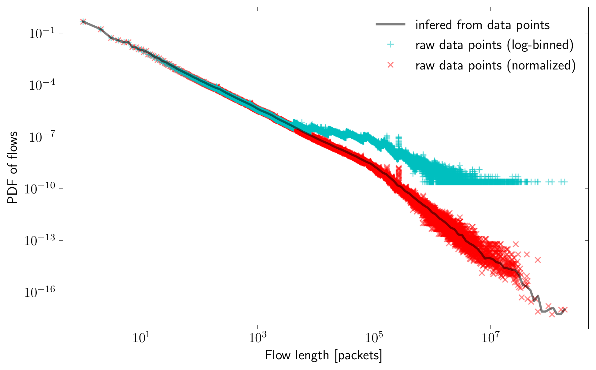

Workflow
********

.. toctree::
   :maxdepth: 2

The overall data pipeline is as follows. First, all flow records have to be collected. Next, before any further processing, the data need to be cleaned and filtered. Since long lasting flows may be reported multiple times due to triggering procedures in the exporters, such flow records have to be found and merged back. The next step is reduction of data passed to the modeling by binning it. Fitting of a general mixture model, approximating the collected data, follows afterwards. Fitted model can be used to mimic real traffic in simulators or traffic generators. Schema of the whole pipeline is presented on the figure below.

.. figure:: _static/schema.svg
   :alt: Schema of the workflow.

Flow definition
===============

The most universal definition of traffic flow in packet network is a sequence of packets which share a common property. Depending on the purpose, flows can be defined at various layers and levels of granularity: layer 4 (five-tuple) or layer 3 (source-destination address pair or destination address/prefix). Any network operator have to decide which fields to consider and this decision usually depends on the operator's scope of operation and traffic engineering purposes. One extreme example are Tier 1 operators which may operate on autonomous system level without even considering IP addresses. However, the most common approach is to determine flow properties based on the packet header fields and to consider source and destination addresses, not exclusively, in different network layers, e.g. data, network, or transport.

In this framework, flow is defined as a unidirectional sequence of packets that share the same five-tuple: IP source address, IP destination address, source port, destination port, and transport layer protocol type. Such an approach follows the NetFlow/IPFIX flow concept and enables application-oriented approach traffic analysis. However, as such a flow definition may not be valid for all networks, the code can be adjusted to other definitions and operator needs.

Collecting of flow records
==========================

The collecting of flow records is the starting point for constructing a network flow model. This step is crucial for obtaining accurate flow feature histograms and resulting mixture models. The well known solutions allowing this are Cisco NetFlow, IPFIX and sFlow. The most common architecture of such concepts consist of two main components: an exporter that is responsible for creation of flow records from observed traffic and a collector that collects and processes flow records generated by the exporter. Collector is usually a software running on a commodity server.

The software framework developed by us is designed to be used primarily on the top of the `nfdump`_ toolset. `nfdump`_ is an open-source package used to collect and process flow records, created by Peter Haag. It supported preliminarily NetFlow data only, but extensions for processing other flow record formats were implemented afterwards. It stores flow records in *nfcapd* binary file format, which is the input format of our framework. This means that our framework can be used to analyze flow records collected in all formats supported by `nfdump`_, which currently are: NetFlow v1, v5/v7, v9, IPFIX and sFlow (both IPv4 and IPv6).

In the case of hardware NetFlow/IPFIX exporters, :manpage:`nfcapd` tool, which is a part of `nfdump`_ package, can be used as a collector. Alternatively, :manpage:`ulogd` can be used on Linux systems to export flows observed on the machine by the Netfilter/Conntrack subsystem into IPFIX records. These records are also collected by :manpage:`nfcapd` and saved into its on-disk format. It is also possible to convert a packet capture file into flow records with :manpage:`nfpcapd` tool. This brings the possibility to analyze and model time-related features (flow durations and rates), which is impossible with data originating from hardware exporters due to timekeeping issues.

Most importantly, packets must not be sampled by the exporter. Packet sampling techniques introduce bias to the collected data, which must be compensated for. NetFlow and IPFIX exporters usually can operate in non-sampling mode. This is not always the case for sFlow, which sometimes imposes mandatory sampling. Therefore, before starting data collection, hardware or software must be configured to work in a non-sampling mode.

Other important configuration parameters regarding the exporter are timeouts. In the case of NetFlow, these are:

inactive timeout
    *Inactive timeout* is the time, after which the particular flow record is exported under the condition that the exporting process does not collect any packet belonging to that flow. This means that packets with the same flow-defining key values, collected before reaching inactive timeout since the last packet will be considered as a single flow, and those collected after the timeout will be treated as a part of a new flow. The value of this timeout is a matter of flow definition and is crucial. For example, in the case of flowlet research, one would set this parameter to some subsecond value. This parameter strongly affects the resulting traffic model.

active timeout
    *Active timeout* defines the time after which particular flow record is exported even when the flow is still active. The aim of this parameter is to limit the amount of memory required to store active flow records and counters in the exporter. In an ideal situation, it should not affect collected flow features as split records can be merged back (see below). However, the process of flows splitting performed by an exporter can introduce errors. Therefore, the timeout should be set to the highest value possible for particular hardware under expected load in order to reduce flow splitting as much as possible.

Cleaning the data
=================

Collected data must be groomed before performing the next steps. The exporter often generates flow records from multiple interfaces of a single device, so the same flow is reported as incoming flow on a one interface and as outgoing flow on another one. Moreover, it may happen that collector gathers data from multiple devices deployed within the same network, so the same flow may be reported multiple times by multiple exporters. Therefore, it must be ensured that data contains only flow records from a single interface of a single device. Moreover, NetFlow hardware exporters sometimes provide corrupted flow records characterized by implausible durations, which need to be filtered out as well.

The :manpage:`nfdump` command line tool can be used to filter out flow records in the *nfcapd* format. It supports powerful and flexible filter syntax similar to tcpdump. It is written in C and very well optimized for filtering tasks. In case of single-homed network simple filtering of flow records that passes boarder router interface connected to the Internet can be applied. If a network is multi-homed, used filter should include all routers and interfaces that are connected upstream.

The example below shows a command which limits flow records to flows passing through a single router on a selected interface and filters out flows longer than 1000 seconds in a single pass: ::

    nfdump -y -r $input_file -w $cleaned_file 'router ip 10.156.119.1 and if 83 and duration < 1000000'

Wrong flow durations may not be only the results of a flow record corruption, but also an inevitable artifact caused by flow exporter. Several artifacts related to timing have been reported in literature. Due to clock synchronization and precision issues, start and end times of flow records may not be precise or just simply incorrect. Another category of timing artifacts is the imprecise or erroneous expiration of flow records.

However, the calculation of flow duration requires accurate timestamps. Similarly, any time-related properties, like packet rate or bit rate, require precise timing. Therefore, used flow exporter must be examined whether it can provide accurate timestamps. In case of our data, we decided not to provide any time-related properties due to inaccuracy of used hardware NetFlow exporter. Ideally, packet-level traces should be analyzed instead flow-level records in order to obtain accurate flow rate and duration distributions.

Merging of flow records
=======================

Flows which were split into separate records due to the active timeout must be merged back into a single record in order to obtain accurate flow length, size or duration values. There is no software available to perform this operation so we developed a dedicated tool, available in our framework (called `tools/merge`).

All flow records are processed in order of appearance. When a flow with a duration shorter than ``active_timeout - inactive_timeout`` is encountered, it is dumped immediately as it is too short to be considered as a flow which was split due to active timeout. On some hardware the export of active flows starts after a delay approximately equal to ``active_timeout - inactive_timeout``, so this value is being used as a safe decision threshold. The *active timeout* deviation can vary between different hardware or even firmware versions.

Flows with a duration greater than ``active_timeout - inactive_timeout`` are considered as potential candidates to merge with subsequent flow records. Therefore, instead of being dumped, they are temporarily cached. When a new flow record with the same key is encountered, it is verified if the arrival time of the first packet is within the inactive timeout interval of the last packet of the cached flow. If so, these flow records are merged by summing their packets and octet counters and adjusting the first and last packet arrival times. Otherwise, the cached flow is dumped immediately and the new flow is either cached or dumped depending on the condition indicating if it can be considered as a candidate to merge.

Some portion of the flow records can be erroneous. For example, a timestamp of the first packet of one flow is within the period when another flow with the same key is active (between its first and last packet timestamps). Such flow records are also filtered out by the merge tool.

Data binning
============

Data binning is a step aimed at reducing the amount of data processed. We took advantage of the fact that next stages aimed at fitting and plotting do not have to be performed on complete flow records. Instead, they can operate on histograms (frequency distribution tables), calculated by binning flow records into buckets according to the selected parameter (such as flow length or size). Histogram files can also be easily published as they are many orders of magnitude smaller and, unlike flow records, do not contain private information such as IP addresses. The framework provides a tool called `tools/hist` which performs flow binning and outputs histogram file in CSV format.

Binning the data into buckets of a width equal to one gives the most precise histogram. However, the resulting number of bins can be huge. This is especially problematic in the case of values of high granularity, such as flow sizes. Each distinct flow size results in a separate bucket entry, which means that for large flows, there are actually separate buckets for each flow.

The solution to the above problem is to use bins of variable widths. For short and small flows, it is desirable to keep precise bins as they account for the vast majority of flows. However, precise bins are not essential for large flows. Therefore, logarithmic binning is the most appropriate scheme. Logarithmic binning can also significantly reduce size of histogram files. Information loss introduced by it is negligible for the accuracy of fitted mixtures and CDF plots, however, it introduces distortion for PDF plots. Therefore, it must be appropriately compensated for during plotting.

In the case of empirical PDF line plots, the best option is to first calculate the interpolated CDF, and second, to differentiate it in order to obtain the PDF line. Such an approach allows circumventing the distortion introduced by variable width binning. The problem appears with plots of PDF datapoints. The figure below presents the plot of PDF of flows in function of flow length. Data points are values of each bin of histogram. The solid line presents the PDF calculated by differentiating the CDF inferred from the data points. It can be seen that log-binned data points (cyan color) for bins wider than one are placed above their actual positions. This is because the variable-width binning bumps up number of flows in those bins. The correct way to compensate that boost is to divide sums in each bucket by the distance to the next non-empty bucket. This normalization procedure is implemented in the `tools/plot` module in our framework, which can be used for plotting histograms, as well as fitted mixtures.

Fitting of mixture models
=========================

The fitting of the probability distribution to the series of the observed data is a process of finding a probability distribution and its parameters. However, due to the complexity of Internet traffic (many network applications and different users' behavior) single distribution cannot be fitted to match the collected data accurately. In such a situation, a mixture of distribution can be used. Such a model is a collection of other well known distributions called mixture components.

Finding mixture components and their weights is not a trivial process, especially when compared to the process of single distribution fitting where maximum-likelihood estimation (MLE) can be applied. To estimate the parameters of a statistical model composed of mixture components, a more sophisticated method must be used. One of the most commonly used machine learning algorithms for this purpose is the Expectation-Maximisation (EM) algorithm, which was also used by us.

We have implemented the EM algorithm in a tool called `tools/fit`, which is a part of our framework. It takes flow histogram CSV file as an input and performs distribution mixture fitting. In order to start the EM algorithm, an initial distribution mixture has to be provided. Its parameters are then iteratively refined in order to find the local optimum. Our tool can receive an initial distribution mixture from a user, but it can also generate an initial mixture for a particular dataset on its own, which means that a user has to only provide number and types of distributions used in mixture.

Currently, *uniform*, *normal*, *lognormal*, *Pareto*, *Weibull* and *gamma* distributions can be used in mixtures fitted by our tool. However, the *uniform* and *lognormal* distributions are usually sufficient to provide an accurate mixture model of flow lengths and sizes. They have an advantage of being fast to fit, since their maximization steps have analytical solutions, whereas some other distribution parameters (*Weibull* or *gamma*) must be calculated using numerical optimization methods. Another advantage is that they are widely implemented, so distribution mixtures composed of them can be usable in various network simulators and traffic generators.

Flow lengths and sizes are quantized values, so they should be approximated using discrete distributions. However, continuous distributions are considerably easier to model and use. In order to use continuous distributions for accurate modeling of a discrete data, it is required to properly handle them during fitting steps. Moreover, values generated using such models must be properly rounded, which is described in the next section.

It is more important to ensure accurate fitting for short and small flows, because they account for the majority of traffic. There are very few flows at the tail (which can be seen on PDF plots), so excessively accurate fitting to them would result in an overfitted model. For example, flows of length of one and two packets make up more than 50% of total number of flows, since they are generated by special phenomena, like port scanning or DNS queries. Therefore, it is most beneficial to model such flows using *uniform* distributions and use heavy-tailed distributions (like *lognormal*) for longer flows. Such a mixture is in fact a hybrid discrete-continuous mixture.

Generating flows from models
============================

In order to be used for benchmarking of network mechanisms, models must enable the generation of traffic with distribution exactly matching that of the used models.

Firstly, *flows* distribution mixture must be used to generate a random sample of flow length or size. A single distribution, randomly chosen from a mixture according to specified weights, has to be used to generate a random value. In case of the `scipy` package, the `rvs <scipy.stats.rv_continuous.rvs>` method can be used for this purpose. Next, in the case of non-continuous variables, such as flow length or size, the generated value must be rounded to the next nearest integer (by truncating the fractional part and adding one). In the case of flow size, values lower than the minimum packet size (64 bytes in the case of Ethernet) must be also rounded up to the minimum packet size.

As we have discovered, the average packet size depends on flow length/size. Thus, in order to accurately model the amount of traffic generated by flows of particular length, one has to obtain an average packet size that flow. To do this, the value of PDF of *octets* at given sample point must be obtained (PDF should be calculated by differentiating the CDF of mixture). Value of PDF of *octets* should be divided the value of PDF of *packets*, obtained in a similar way. In the end, the resulting value has to be multiplied by the average packet size of the used model.

The tool `tools/generate` in our framework can be used as a reference how to properly generate flows from distribution mixtures.
